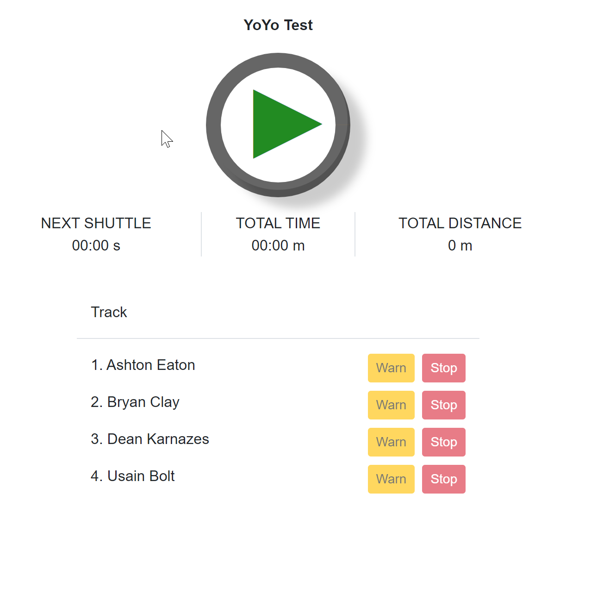
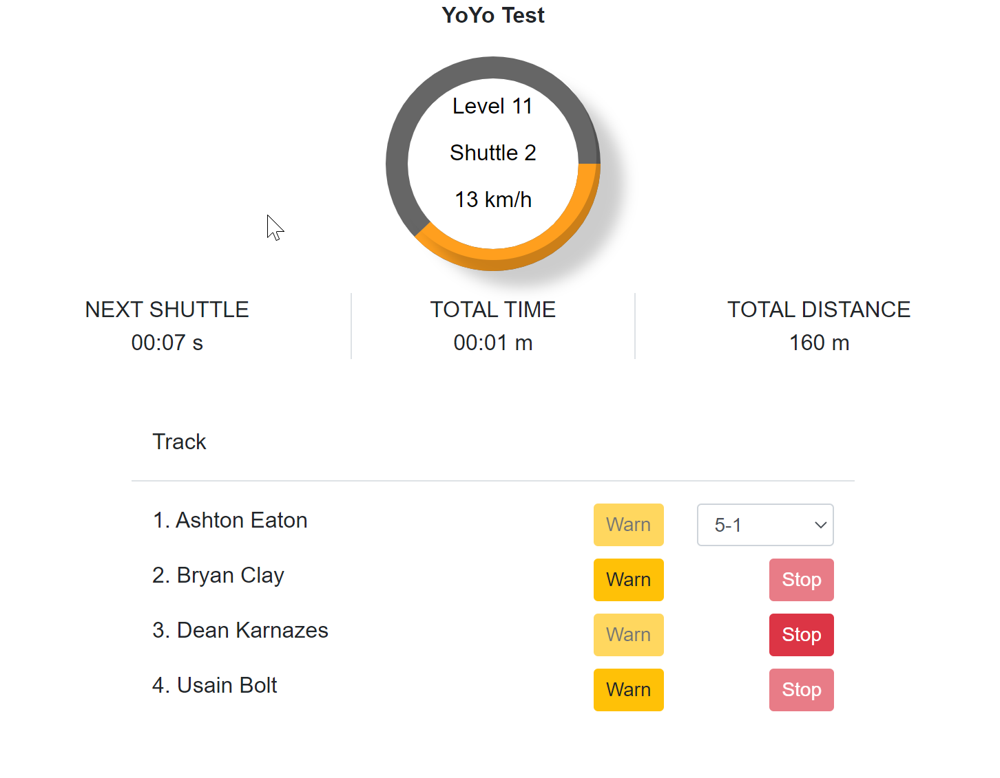
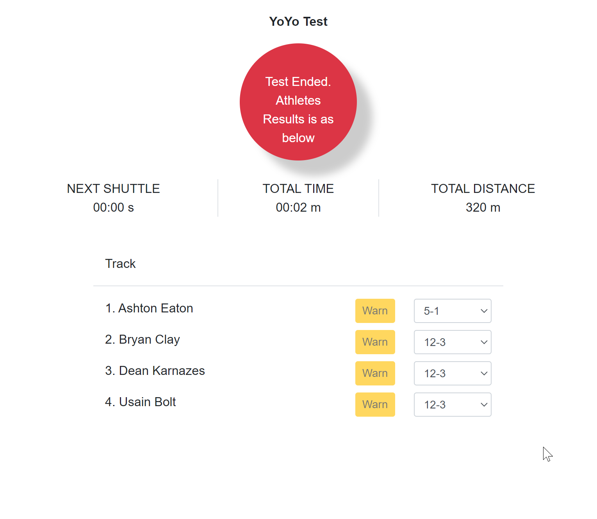

## YO-YO APP

- Project structure looks is web has all the UI related functionalities and Repository is the one which talks to the json files in our case and the Business is the project which ties the repo and web projects. 
- Loads the data from the json file which can be configured in app settings file like this
    ```js
    "FileRepository": {
    "Athletes": "data/athletes.json",
    "Shuttles": "data/fitnessrating_beeptest.json"
    }
    ```
- One json file to list the athletes another represent the schema for the shuttles and its respective details
- On clicking the start button the application starts a timer which will load the shuttles from the file as per the current time and display the stats
- The progress bar shows the time left to the next shuttle
- The stats are displayed below the circular progress bar indicating the time left to next shuttle, total passed in  hours:minutes format and the total distance traversed
- The progress bar control is created using the svg created from css in `site.css > #roundProgressBar`
- The `Repository` is desgined in way to accomodate any new models or any new different kind of `DataLoader` for now its for shuttle and athlete using Json file
- To maintain type safety custom Json Convertors are used and time is always represented as `TimeSpan` type
- All the file path configuration that is give in appsettings uses Options Pattern so that its type safe again
- Data loaders are fed with this configuraion when registering with the DI engine 

### Screenshots

- On first loading the application
 


- After starting the test



- After the test Ends
  
